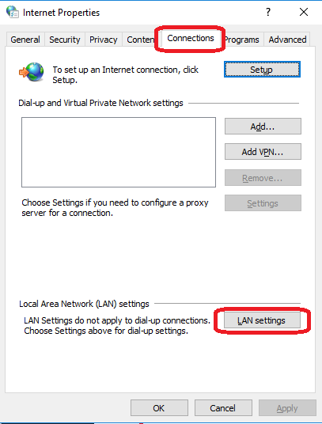
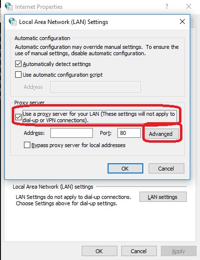
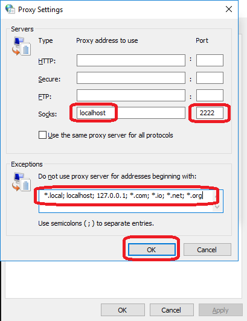

Connecting to the ATI Cray Urika
=================================

This chapter explains how to connect to the ATI Cray Urika service. This requires a user account on BOTH the Urika and hydra-vpn.epcc.ed.ac.uk. See the chapter :doc:`introduction` for instructions on how to get these user accounts.

Access to the ATI Cray Urika service is via SSH. The applications software on Cray Urika itself can be accessed via a web browser. This chapter explains how to setup an SSH tunnel from hydra-vpn.epcc.ed.ac.uk to Cray Urika so that a web browser can be used to access the applications software. It also explains how to access Cray Urika's command line directly.

An overview of how to connect is as follows. Instructions are provided for:

* Windows: using `PuTTY <https://putty.org>`_ or the ssh client in `Git for Windows <https://git-for-windows.github.io/>`_ SSH clients and Mozilla Firefox, Internet Explorer and Google Chrome web browsers.
* MacOS and Linux: using ssh client and Mozilla Firefox web browser.

Other SSH client software and web browsers can also be used if they are suitably configured.

Connecting involves the following steps:

1. `Set up an SSH tunnel to Cray Urika`_.
2. `Modify the hosts file`_.
3. `Configure web browser to access Cray Urika's applications software`_.
4. `Use web browser to access Cray Urika's applications software`_.

Alternatively you can:

* `Connect to Cray Urika via the command-line`_.

In the following:

* Replace ``your-hydra-vpn-username`` with your hydra-vpn.epcc.ed.ac.uk username.
* Replace ``your-urika-username`` with your Cray Urika username.

Set up an SSH tunnel to Cray Urika
----------------------------------

If you are a Windows user, you can do one of:

* `Set up an SSH tunnel using PuTTY`_.
* `Set up an SSH tunnel using PuTTY and the Command Prompt`_.
* `Set up an SSH tunnel using Git for Windows`_.

If you are a MacOS or Linux user, you can:

* `Set up an SSH tunnel using ssh`_.

Set up an SSH tunnel using PuTTY
^^^^^^^^^^^^^^^^^^^^^^^^^^^^^^^^

1. Start PuTTY.

2. PuTTY's Configuration should appear, showing the Session configuration.

3. In the 'HostName (or IP address)' field, enter ``hydra-vpn.epcc.ed.ac.uk``. See below.

.. image:: PuTTY-Session-hydra-vpn.PNG

4. Click 'Connection', then 'SSH', then 'Tunnels' on the left-hand menu.

5. In the 'Source port' field, enter ``2222``

6. Click the radio button beside 'Dynamic'. See below.

.. image:: PuTTY-Connection-SSH-tunnels-hydra-vpnCapture.PNG

7. Press the 'Add' button. ``D2222`` will be added to the list of 'Forwarded ports'. See below.

.. image:: PuTTY-Add-dynamic.PNG

8. Press the 'Open' button.

9. A PuTTY terminal window will appear. This contains a login prompt. See below.

.. image:: PuTTY-hydra-terminal.PNG

10. Enter your hydra-vpn.epcc.ed.ac.uk username and password.

Now, skip down to `Modify the hosts file`_.

Set up an SSH tunnel using PuTTY and the Command Prompt
^^^^^^^^^^^^^^^^^^^^^^^^^^^^^^^^^^^^^^^^^^^^^^^^^^^^^^^

1. Start a Command Prompt.

2. Enter the command::

    putty.exe -ssh <your-hydra-vpn-username>@hydra-vpn.epcc.ed.ac.uk -D 2222

3. Enter your hydra-vpn.epcc.ed.ac.uk username and password.

Now, skip down to `Modify the hosts file`_.

Set up an SSH tunnel using Git for Windows
^^^^^^^^^^^^^^^^^^^^^^^^^^^^^^^^^^^^^^^^^^

1. Start a Git Bash command prompt:

  - Either, select Start => 'Git' => 'Git Bash'.
  - Or, enter ``Git Bash`` into the toolbar search box.

2. Enter the command::

    ssh -D 2222 <your-hydra-vpn-username>@hydra-vpn.epcc.ed.ac.uk

Now, skip down to `Modify the hosts file`_.

Set up an SSH tunnel using ssh
^^^^^^^^^^^^^^^^^^^^^^^^^^^^^^

1. Open a Terminal.

2. Enter the command::

    ssh -D 2222 <your-hydra-vpn-username>@hydra-vpn.epcc.ed.ac.uk

Modify the hosts file
----------------------

The ``hosts`` file helps to resolves domain names without going via a DNS server. If IP address is found for a domain name then that domain name is used. Here, it is used to map Urika's IP addresses to Urika's domain names.

1. Edit the ``hosts`` file. This can be found in the following location:

  * Windows: ``C:\Windows\System32\drivers\etc\hosts``
  * MacOS: ``/etc/hosts``
  * Linux: ``/etc/hosts``

2. Add the following lines::

    172.24.40.11 urika1.turing.ac.uk
    172.24.40.12 urika2.turing.ac.uk

If you cannot find the ``hosts`` file, or do not have the privileges to modify this file, then please contact your local systems administrator for help.

Here is an example file with these lines added ::

    # Copyright (c) 1993-2009 Microsoft Corp.
    #
    # This is a sample HOSTS file used by Microsoft TCP/IP for Windows.
    #
    # This file contains the mappings of IP addresses to host names. Each
    # entry should be kept on an individual line. The IP address should
    # be placed in the first column followed by the corresponding host name.
    # The IP address and the host name should be separated by at least one
    # space.
    #
    # Additionally, comments (such as these) may be inserted on individual
    # lines or following the machine name denoted by a '#' symbol.
    #
    # For example:
    #
    #      102.54.94.97     rhino.acme.com          # source server
    #       38.25.63.10     x.acme.com              # x client host
    
    # localhost name resolution is handled within DNS itself.
    #	127.0.0.1       localhost
    #	::1             localhost
    172.24.40.11 urika1.turing.ac.uk
    172.24.40.12 urika2.turing.ac.uk

Configure web browser to access Cray Urika's applications software
------------------------------------------------------------------

Once you have set up an SSH tunnel and modified the ``hosts`` file, you now need to configure your web browser to access Cray Urika's applications software.

If you are a Windows, MacOS or Linux user, you can:

* `Configure Mozilla Firefox`_.

If you are a Windows user, you can alternatively:

* `Configure Internet Explorer or Google Chrome on Windows`_.

Configure Mozilla Firefox
^^^^^^^^^^^^^^^^^^^^^^^^^

1. Start Firefox.

2. Open the advanced network settings:

   * If using Firefox Quantum 60.0:

     1. Select Menu => 'Options'
     2. Scroll down to Network Proxy
     3. Click 'Settings...

   * If using Firefox ESR 52.2.0:

     1. Select Menu => 'Preferences'
     2. Click 'Advanced'
     3. Click 'Network'
     4. Click 'Settings...', next to 'Configure how Firefox connects to the Internet'. See below.

.. image:: Firefox-options-advanced-network.PNG

3. Click the radio button for 'Manual proxy configuration:'. 

4. In the 'SOCKS Host' field, enter ``localhost``

5. In the adjoining 'Port:' field, enter ``2222``. 

6. Click the radio button for 'SOCKS v5'. 

7. In the 'No proxy for:' field, enter ``localhost, 127.0.0.1, .com, .io, .net, .org``. See below.

.. image:: Firefox-settings.PNG

8. Press 'OK'.

Now, skip down to `Use web browser to access Cray Urika's applications software`_.

Configure Internet Explorer or Google Chrome on Windows
^^^^^^^^^^^^^^^^^^^^^^^^^^^^^^^^^^^^^^^^^^^^^^^^^^^^^^^

Both Internet Explorer and Google Chrome use Windows Internet Options.

**Note:** Changing the Internet Options affects Windows as a whole. You may want to `Configure Mozilla Firefox`_ and use it instead if you do not want a system-wide change.

1. Open Internet Options:

   * Via Toolbar Search box: 
     - Enter 'Internet Options'

   * Via Windows Control Panel:

     1. Click 'Network and Internet'
     2. Click 'Internet Options'

   * Via Internet Explorer:

     * Select Cog icon => 'Internet options'

   * Via Google Chrome:

     1. Click 'Settings'
     2. Click 'Advanced'
     3. Click 'System'
     4. Click 'Open proxy settings'

2. Click 'Connections'. See below.

3. Click 'LAN settings'.

4. Click the radio button for 'Use a proxy server for your LAN...'. See below.

5. Click 'Advanced'.

6. In the SOCKS field, enter: ``localhost``

7. In the adjoining field, enter: ``2222``

8. In the 'Exceptions:' field, enter: ``*.local; localhost; 127.0.0.1;*.com;*.io;*.net;*.org``. See below.

9. Click the 'OK' button

10. Click the 'OK' button

Now, skip down to `Use web browser to access Cray Urika's applications software`_.

Use web browser to access Cray Urika's applications software
------------------------------------------------------------

Once you have set up an SSH tunnel, modified the ``hosts`` file and configured your web browser, you can now use your web browser to connect to Cray Urika's applications software user interface.

Enter::

    http://urika1.turing.ac.uk/home

into your browser and the following view of the Urika user interface will appear.

.. image:: urika.PNG

If you are using Internet Explorer or Google Chrome and you get a warning that ``This site is not secure`` appears:

1. Click 'More information'
2. Click 'Go on to the webpage (not recommended)'

Connect to Cray Urika via the command-line
------------------------------------------

The commands above to `Set up an SSH tunnel to Cray Urika`_ also connect to hydra-vpn.epcc.ed.ac.uk via the command-line.

If you do not care about tunnelling or using a web browser then the commands are simpler.

If you are a Windows user, you can do one of:

* `Connect to Cray Urika using PuTTY`_.
* `Connect to Cray Urika using PuTTY and the Command Prompt`_.
* `Connect to Cray Urika using Git for Windows`_.

If you are a MacOS or Linux user, you can:

* `Connect to Cray Urika using ssh`_.

Connect to Cray Urika using PuTTY
^^^^^^^^^^^^^^^^^^^^^^^^^^^^^^^^^

1. Start PuTTY.

2. PuTTY's Configuration should appear, showing the Session configuration.

3. In the 'HostName (or IP address)' field, enter ``hydra-vpn.epcc.ed.ac.uk``. See below.

.. image:: PuTTY-Session-hydra-vpn.PNG

4. Press the 'Open' button.

5. A PuTTY terminal window will appear. This contains a login prompt. See below.

.. image:: PuTTY-hydra-terminal.PNG

6. Enter your hydra-vpn.epcc.ed.ac.uk username and password.

Now, skip down to `Connect to Cray Urika from hydra-vpn.epcc.ed.ac.uk`_.

Connect to Cray Urika using PuTTY and the Command Prompt
^^^^^^^^^^^^^^^^^^^^^^^^^^^^^^^^^^^^^^^^^^^^^^^^^^^^^^^^

1. Start a Command Prompt.

2. Enter the command::

    putty.exe -ssh <your-hydra-vpn-username>@hydra-vpn.epcc.ed.ac.uk

3. Enter your hydra-vpn.epcc.ed.ac.uk username and password.

Now, skip down to `Connect to Cray Urika from hydra-vpn.epcc.ed.ac.uk`_.

Connect to Cray Urika using Git for Windows
^^^^^^^^^^^^^^^^^^^^^^^^^^^^^^^^^^^^^^^^^^^

1. Start a Git Bash command prompt:

  - Either, select Start => 'Git' => 'Git Bash'.
  - Or, enter ``Git Bash`` into the toolbar search box.

2. Enter the command::

    ssh <your-hydra-vpn-username>@hydra-vpn.epcc.ed.ac.uk

Now, skip down to `Connect to Cray Urika from hydra-vpn.epcc.ed.ac.uk`_.

Connect to Cray Urika using ssh
^^^^^^^^^^^^^^^^^^^^^^^^^^^^^^^

1. Open a Terminal.

2. Enter the command::

    ssh <your-hydra-vpn-username>@hydra-vpn.epcc.ed.ac.uk

Connect to Cray Urika from hydra-vpn.epcc.ed.ac.uk
--------------------------------------------------

Once you have logged in to hydra-vpn.epcc.ed.ac.uk, you can log into Cray Urika via the command-line as follows.

Either, enter::

    ssh <your-urika-username>@172.24.40.11

Or, enter::

    ssh <your-urika-username>@172.24.40.12

When prompted, enter the password for your **Urika** account.

You will be presented with the Urika command line.

Tested platforms and tools
--------------------------

These instructions have been tested on the following platforms and tools.

* Operating systems:

  - Windows 10 Enterprise.
  - `CentOS <https://www.centos.org>`_ Linux release 7.4.1708 (Core) virtual machine running under VMWare Workstation 14 on Windows 10 Enterprise.

* SSH clients:

  - `Putty <https://putty.org>`_ 0.70 64-bit Windows.
  - `Git for Windows <https://git-for-windows.github.io/>`_ 2.15.1 on Windows 10 Enterprise.
  - OpenSSH_7.6p1, OpenSSL 1.0.2m  2 Nov 2017, provided in Git fot Windows 2.15.1.
  - OpenSSH_7.6p1, OpenSSL 1.0.2m  2 Nov 2017, provided in CentOS 7.

* Web browsers:

  - `Mozilla Firefox <https://www.mozilla.org/en-US/firefox/>`_:

    * Quantum 60.0 (64-bit) under Windows 10 Enterprise.
    * ESR 52.2.0 (64-bit) under CentOS 7.

  - Internet Explorer 11 under Windows 10 Enterprise.
  - `Google Chrome <https://www.google.co.uk/chrome/>`_ 66 under Windows 10 Enterprise.
