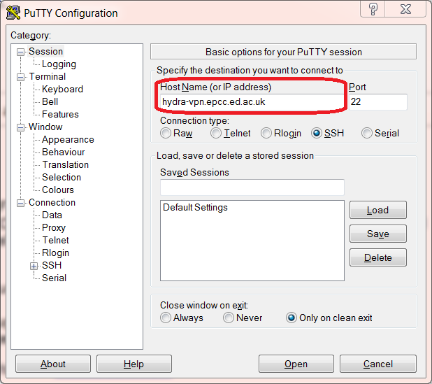
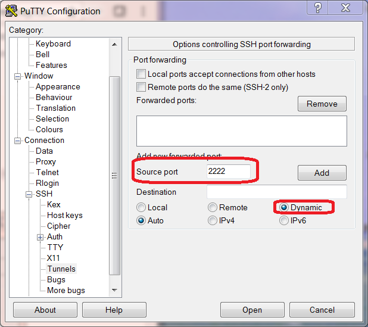
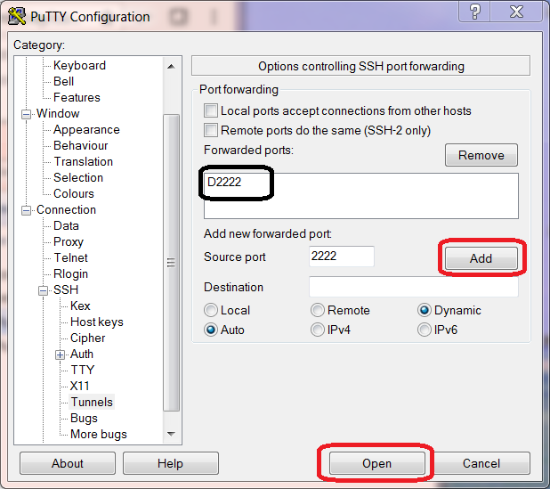
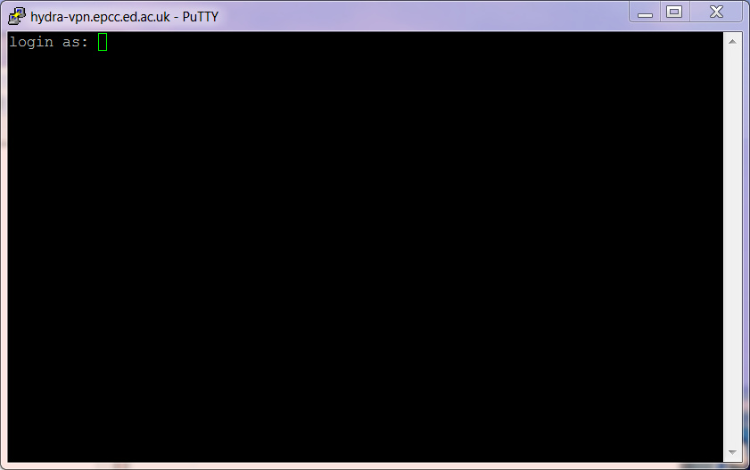
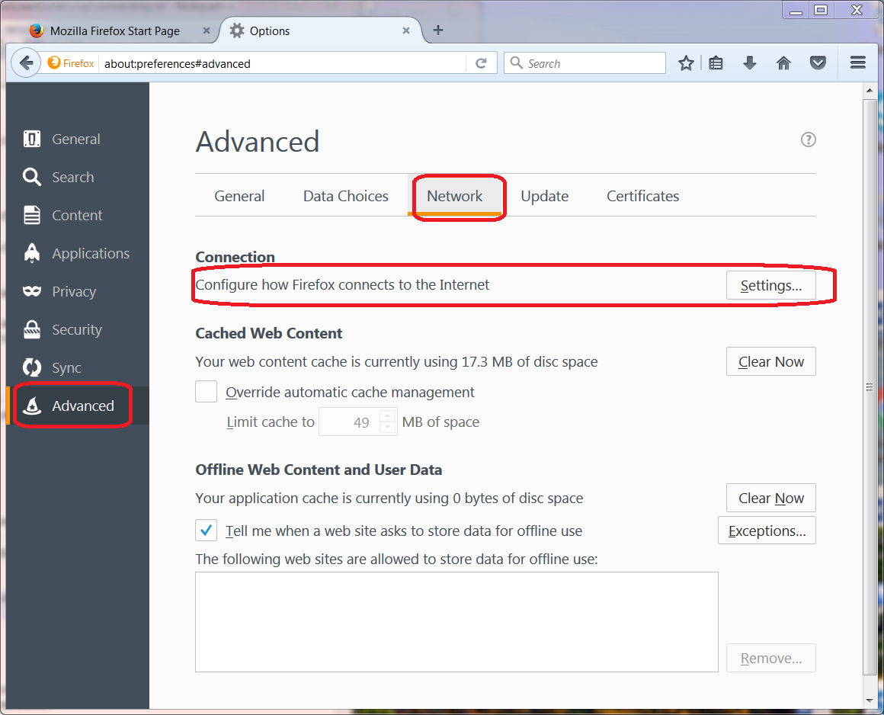
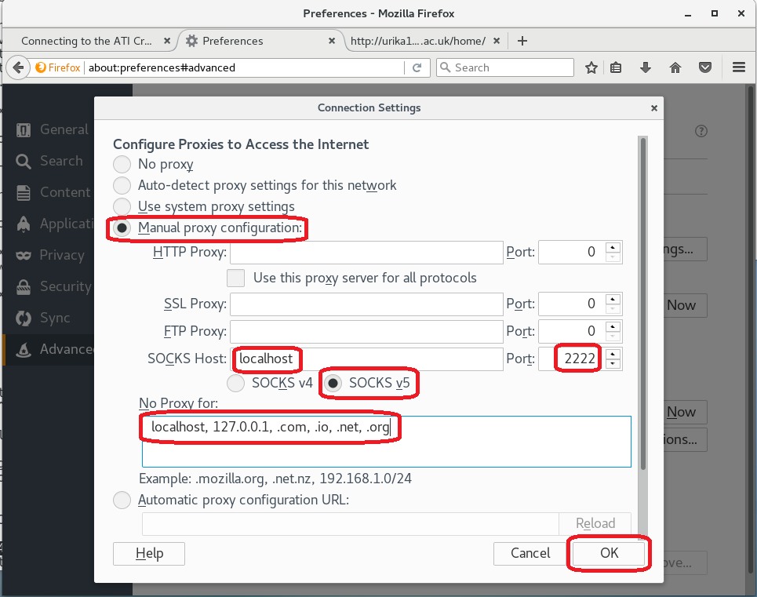
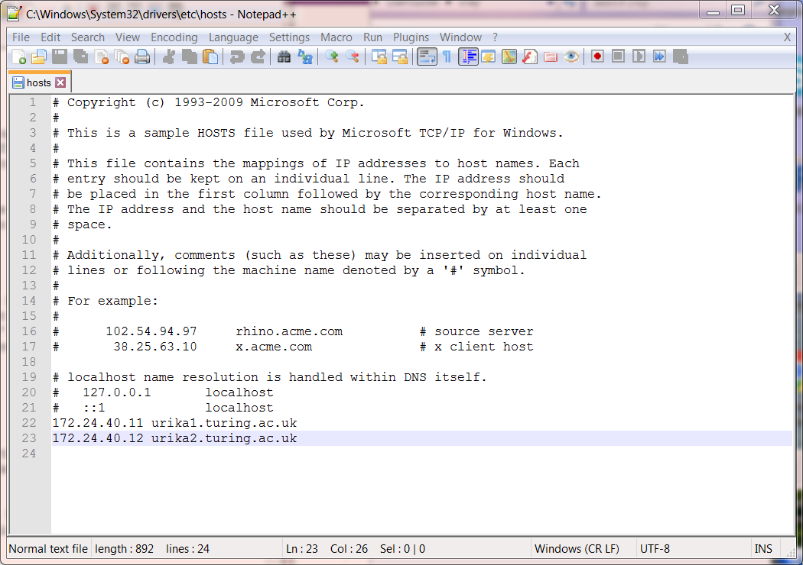
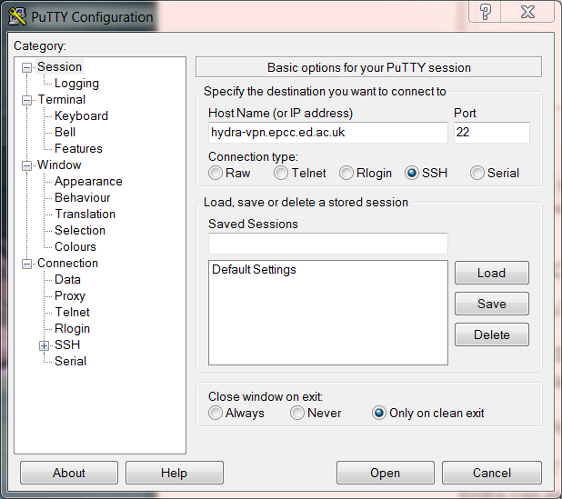

Connecting to the ATI Cray Urika
=================================

This chapter explains how to connect to the ATI Cray Urika service. This requires
a user account on BOTH the Urika and hydra-vpn.epcc.ed.ac.uk. See the chapter 
:doc:`introduction` for instructions on how to get these user accounts.

Access to the ATI Cray Urika service is via SSH. The applications software 
on the Cray Urika itself can be accessed via a web browser. This chapter explains 
how to setup an SSH tunnel from hydra-vpn.epcc.ed.ac.uk to the Urika service
so that a web browser can be used to access the applications software.

The instructions are based upon using PuTTY as the SSH client software on Windows 
(see `Setting up an SSH tunnel using PuTTY`_ below) and Mozilla Firefox as the web browser
(see `Configuring Mozilla Firefox`_ below).  Other SSH client software and web browser could 
be used if they are suitably configured. When using a Windows PC, the hosts 
file also needs to be modified (see `Modifying the hosts file`_ below). Once you have done all this, following the instructions in 
`Using Mozilla Firefox to connect the Urika User Interface`_

Setting up an SSH tunnel using PuTTY
------------------------------------

1. Start PuTTY

2. In the PuTTY Session window, put 'hydra-vpn.epcc.ed.ac.uk' into the
'HostName (or IP address)' field. See below.

3. Next go to 'Connection -SSH -Tunnels' on the left hand menu.

4. In the 'Source port' field type '2222' then click on the radio button beside 'Dynamic'. See below

5. Now press the 'Add' button and 'D2222' will be added to the list of 
'Forwarded ports:' After this press the 'Open' button. See below.

6. A PuTTY terminal window will then appear.  This contains a login prompt. 
Enter your hydra-vpn.epcc.ed.ac.uk username and password. See below.

Configuring Mozilla Firefox
----------------------------

Once you have logged onto hydra-vpn with an SSH tunnel set up 
(See `Setting up an SSH tunnel using PuTTY`_), you must then configure your web broswer so it can use this SSH tunnel. The instructions below explain to configure Mozilla Firefox to use this SSH tunnel.

1. Start up an instance of Firefox and go to 'Options'. Once here go to 'Advanced', 'Network'. Once there click on the 'Settings' button next to 'Configure how Firefox connects to the Internet'. See below.

2. In the resulting 'Settings' dialogue, click on the radio button for 'Manual proxy configuration:'. In the 'SOCKS Host' field, enter 'localhost'. In the adjoining 'Port:' field enter '2222'. Click on the radio button for 'SOCKS v5'. In the 'No proxy for:' field enter 'localhost, 127.0.0.1,.com,.com,.io,.net,.org' then press 'OK'. See below.

Modifying the hosts file
------------------------

The next step is to configure the hosts file on your PC so that Firefox 
knows where to find the applications referred to in the Urika User 
Interface.

(If you are unsure where the hosts file is or if you do not have the privileges to 
modify this file then please contact your local systems administrator for
help.)

You can usually find the hosts file in the folder::

  C:\Windows\System32\drivers\etc

Open the file and add the following two lines to the end of file ::

	172.24.40.11 urika1.turing.ac.uk
	172.24.40.12 urika2.turing.ac.uk

Here is an example file with these lines added.

	
Using Mozilla Firefox to connect the Urika User Interface
---------------------------------------------------------

Now that you have finished `Modifying the hosts file`_, `Configuring Mozilla Firefox`_ and `Setting up an SSH tunnel using PuTTY`_ you can now use your Firefox browser to connect to the applications software user interface on the Urika GX system.

Enter ::

	http://urika1.turing.ac.uk/home
	
into your browser and the following view of the Urika user interface will appear.

Connecting to Urika command line using PuTTY
--------------------------------------------

1. Start PuTTY

2. In the PuTTY Session window, put 'hydra-vpn.epcc.ed.ac.uk' into the
'HostName (or IP address)' field then click *Open*

3. A PuTTY terminal window will then appear.  This contains a login prompt. 
Enter your hydra-vpn.epcc.ed.ac.uk username and password.  

4. At the resulting command line type in 
``ssh your-urika-username@172.24.40.11`` or ``ssh your-urika-username@172.24.40.12``
and when prompted type in the password for your **Urika** account.	You will then be presented with the Urika command line.

