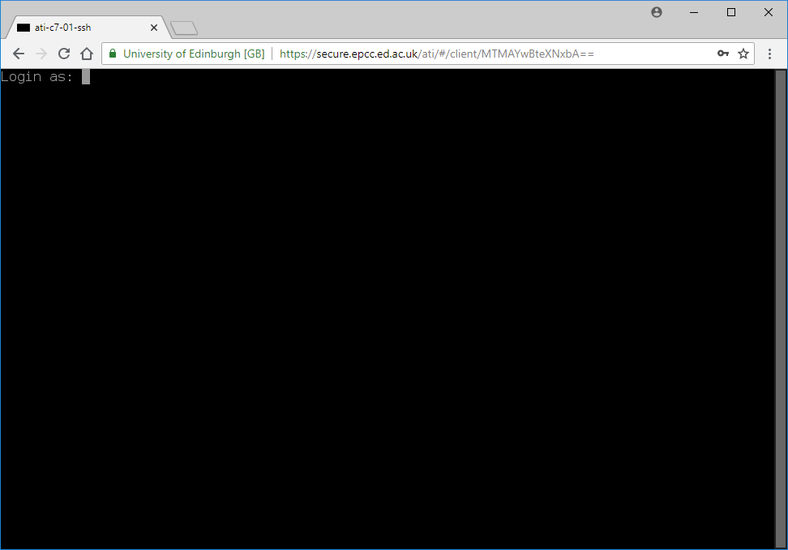
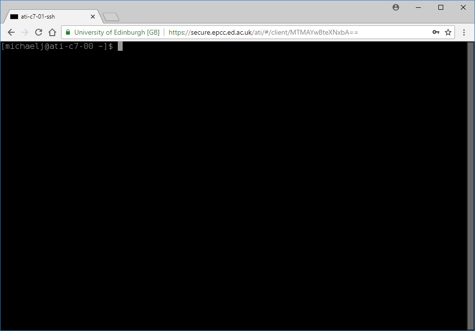
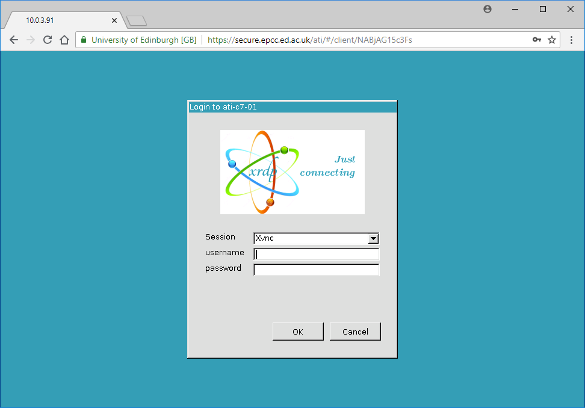
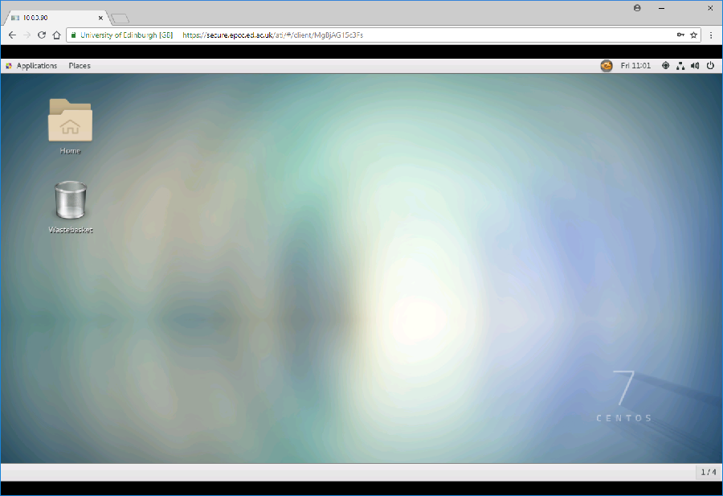
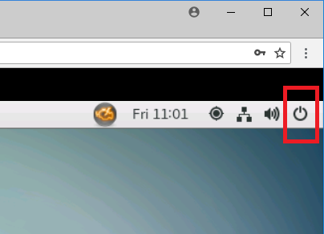
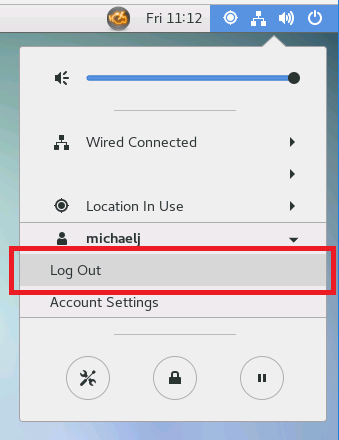

Connecting to Atiras
====================

This chapter explains how to connect to the Alan Turing Remote Access Service (Atiras) and, once connected, to the virtual machines within the Secure Safe Haven and the build arena.

If you are a researcher wanting to access a virtual machine for your project within the Secure Safe Haven, you need: 
 
#. An account for the Atiras portal to access the Secure Safe Haven. 
#. An account for a virtual machine in the Secure Safe Haven. 
 
If you are one of your project's researcher administrators or researcher developers wanting to access a virtual machine for your project within the build arena, you need: 
 
#. An account for the Atiras portal to access the build arena. 
#. An account for a virtual machine in the build arena. 
 
See the chapter :doc:`introduction` for instructions on how to get these user accounts.

Access to, and usage of, Atiras, and virtual machines within the Secure Safe Haven and build arena is done entirely from within a web browser, via the Atiras portal.

Use web browser to access the Atiras portal
-------------------------------------------

Visit `https://secure.epcc.ed.ac.uk/ati/ <https://secure.epcc.ed.ac.uk/ati/>`_ in your web browser.

The Atiras portal will appear:

.. image:: AtirasPortal.png

If you want to access the Secure Safe Haven then enter your **Atiras portal Secure Safe Haven** username and password and click 'Login'.

If you want to access the build arena then enter your **Atiras portal build arena** username and password and click 'Login'.

You will be presented with your home page. When logging in for the first time the home page will look something like:

.. image:: AtirasHome.png

View your available connections
-------------------------------

The home page shows your *connections*, the virtual machine which you can connect to:

* If you entered your **Atiras portal Secure Safe Haven** username then you will see your project's Secure Safe Haven virtual machine.
* If you entered your **Atiras portal build arena** username then you will seeyour project's build arena virtual machine.

The home page shows:

* 'RECENT CONNECTIONS' shows screen shots of virtual machines you have recently connected to (i.e. logged in to). When you log in for the first time, 'RECENT CONNECTIONS' will show 'No recent connections', as shown above.
* 'ALL CONNECTIONS' shows a list of all the virtual machines you can connect to. For example, ``ati-c7-01`` above.

Clicking on virtual machine names in 'ALL CONNECTIONS' shows connection options for that virtual machine e.g.

.. image:: AtirasConnections.png

There are two types of connection option:

* RDP (remote desktop protocol), suffix ``-rdp`` (for example ``ati-c7-01-rdp``). This connection allows you to use the virtual machine via a remote desktop.
* SSH (secure shell), suffix ``-ssh`` (for example ``ati-c7-01-ssh``). This connection allows you to use the virtual machine via a command-line terminal.

On subsequent sessions, you will see your recent connections e.g.

.. image:: AtirasRecentConnections.png

Connect via SSH (secure shell) session
--------------------------------------

To connect to a virtual machine via an SSH session, right-click on the ``-ssh`` connection for that virtual machine and select "Open link in new tab". This can be done under either 'ALL CONNECTIONS' or, for virtual machines to which you have connected before, under 'RECENT CONNECTIONS'.

You will be shown a command-line terminal with a login prompt e.g.

If accessing the Secure Safe Haven, enter your **Secure Safe Haven virtual machine** username and password and press ENTER.

If accessing the build arena, enter your **build arena virtual machine** username and password and press ENTER.

You will be presented with a bash prompt e.g.

Connect via RDP (remote desktop) session
----------------------------------------

To connect to a virtual machine via an RDP session, right-click on the ``-rdp`` connection for that virtual machine and select "Open link in new tab". This can be done under either 'ALL CONNECTIONS' or, for virtual machines to which you have connected before, under 'RECENT CONNECTIONS'.

You will be shown a login dialog e.g.

If accessing the Secure Safe Haven, enter your **Secure Safe Haven virtual machine** username and password click 'OK'.

If accessing the build arena, enter your **build arena virtual machine** username and password and click 'OK'.

You will be presented with a desktop e.g.

**Note:** the first time you log into a virtual machine via RDP you may have to work through a few screens to configure your local environment (e.g. select your preferred language etc).

Disconnect from SSH (secure shell) session
------------------------------------------

Enter::

    exit

Or, press CTRL-D.

You will then be presented with a number of options, see :ref:`DisconnectSession`.

Disconnect from RDP (remote desktop) session
--------------------------------------------

Click the button icon on the top right hand side of the desktop:

You will be presented with a dialog box. Click your user name then select 'Log Out':

A 'Log Out <your-virtual-machine-username>' dialog box will appear. Click 'Log Out'.

You will then be presented with a number of options, see :ref:`DisconnectSession`.

.. _DisconnectSession:

After disconnecting from a session
----------------------------------

Once you exit from an RDP or SSH session you will be shown a 'DISCONNECTED' dialog:

.. image:: AtirasDisconnected.png

There are three options:

* Return to the Atiras portal home page: Click 'Home'.
* Reconnect session: Click 'Reconnect'.
* Logout from the Atiras portal: Click 'Logout'.

Change your Atiras portal password
----------------------------------

You can change your Atiras portal password as follows:

#. Click the menu labelled by your username at the top-right of the page.  
#. Select 'Settings'.  
#. Fill in the following fields:
    - 'Current Password'
    - 'New Password'
    - 'Confirm New Password'
#. Click 'Update Password'.  

Change your virtual machine password
------------------------------------

If running a SSH (secure shell) session, or from terminal window in an RDP (remote desktop) session

#. Run:: 
 
    passwd 
 
#. You will be prompted to enter your old password. 
#. You will be prompted to enter your new password twice. 

Alternatively, if running an RDP (remote desktop) session:

#. Click the button icon on the top right hand side of the desktop:

    .. image:: RdpButton.png

#. You will be presented with a dialog box. Click your user name then select 'Account Settings':

    .. image:: RdpAccountSettings.png

#. Click '<your-virtual-machine-username>' on the row of user names.
#. Click the button (with five blobs) next to the 'Password' field.
#. Fill in the following fields:
    - 'Current Password'
    - 'New Password'
    - 'Verify New Password'
#. Click 'Change'. 

Logout from the Atiras portal
-----------------------------

To logout from the Atiras portal when on the home page:

#. Click the menu labelled by your username at the top-right of the page.
#. Select 'Logout'.
