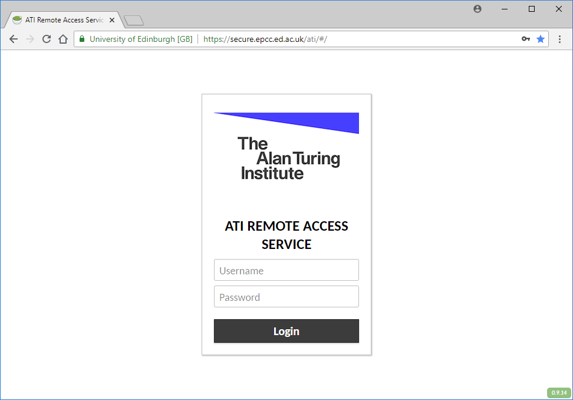
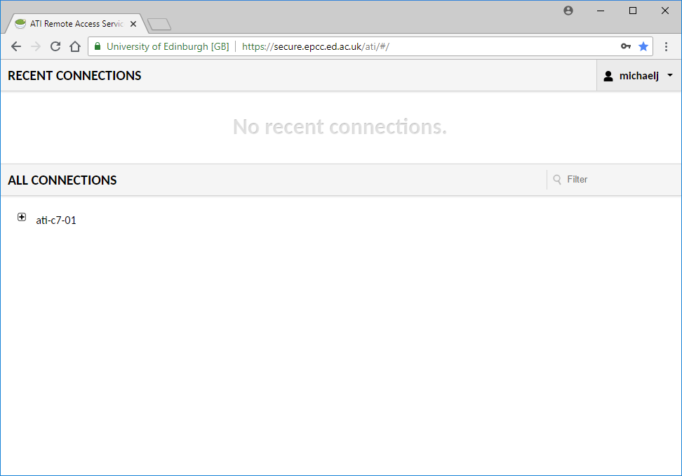
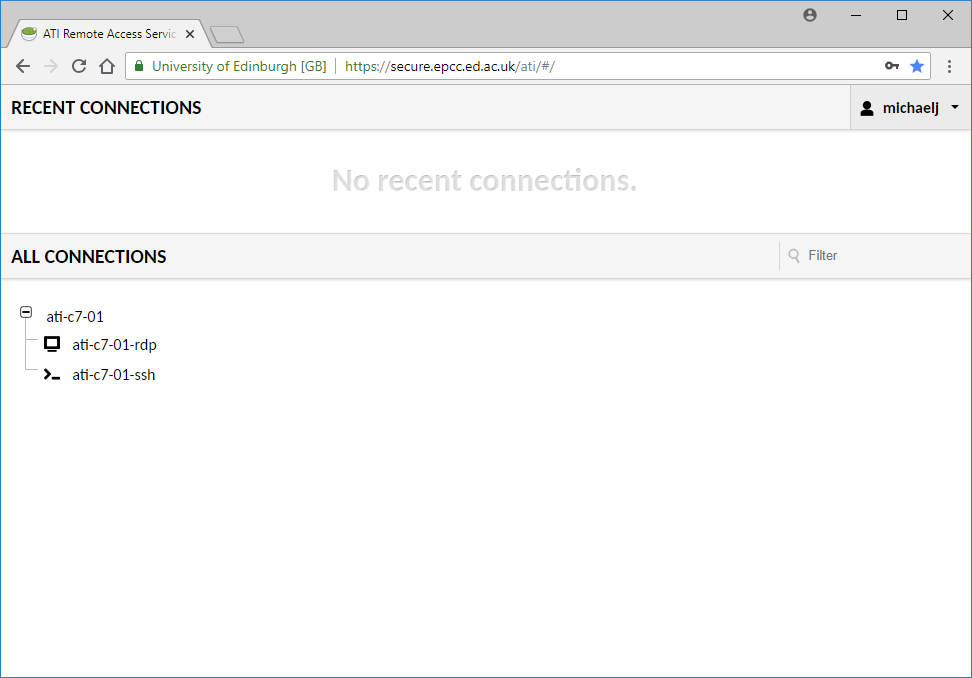
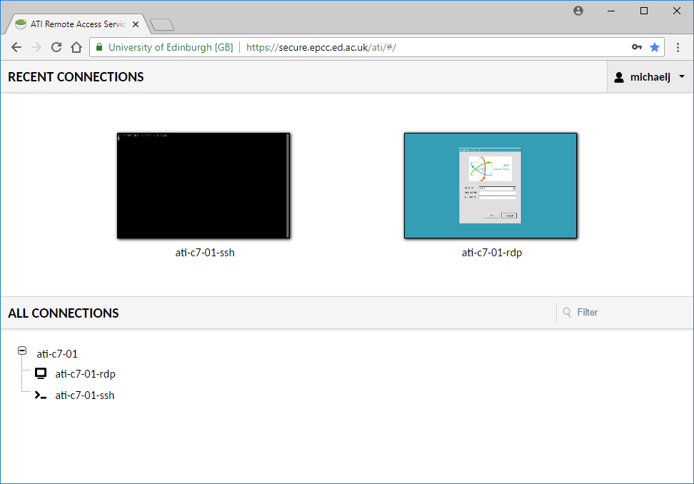
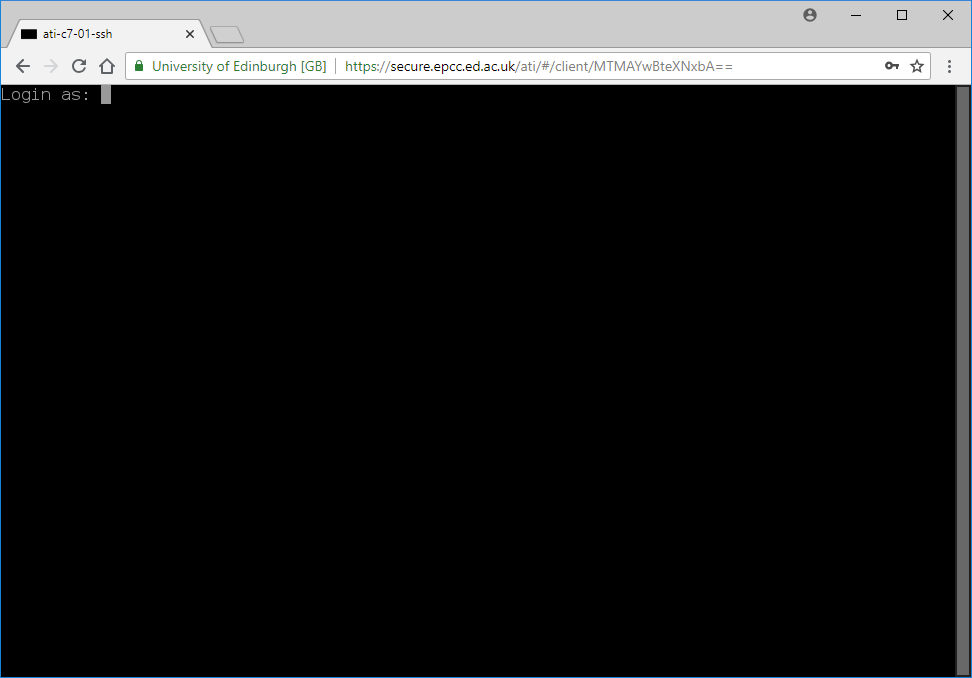
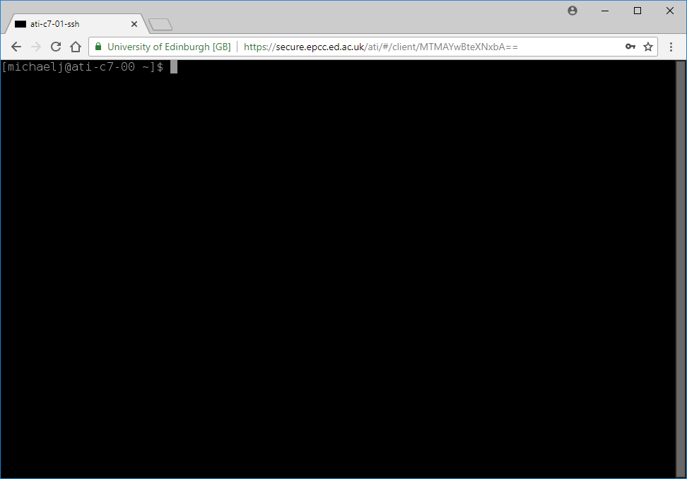
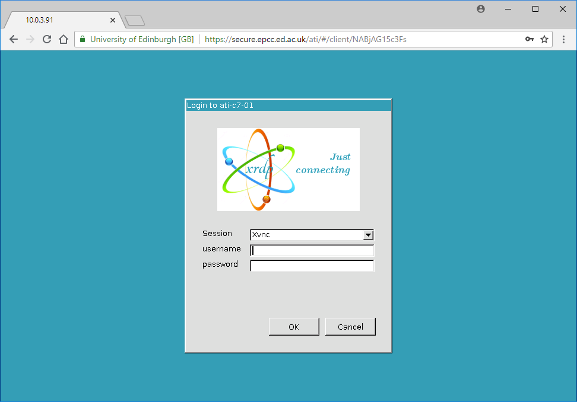
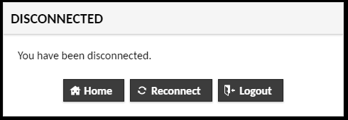

Connecting to Atiras and the Intel cluster within the Secure Safe Haven
=======================================================================

This chapter explains how to connect to both the Alan Turing Remote Access Service (Atiras) and, once connected, the Intel cluster within the Secure Safe Haven. You need user accounts on BOTH Atiras and the Intel cluster within the Secure Safe Haven. See the chapter :doc:`introduction` for instructions on how to get these user accounts.

Access to, and usage of, Aritas, and the Intel cluster within the Secure Safe Haven, is done entirely from within a web browser, via the Atiras portal.

Use web browser to access the Atiras portal
-------------------------------------------

Enter::

    https://secure.epcc.ed.ac.uk/ati/

into your browser and the following view of the Atiras portal will appear.

Enter your **Atiras** username and password and click 'Login'.

You will be presented with your home page. When logging in for the first time the home page will look something like:

View your available connections
-------------------------------

The home page shows your *connections*, the virtual machines which you can connect to from within Atiras:

* 'RECENT CONNECTIONS' shows screen shots of virtual machines you have recently connected to (i.e. logged in to). When you log in to Atiras for the first time, 'RECENT CONNECTIONS' will show 'No recent connections', as shown above.
* 'ALL CONNECTIONS' shows a list of all the virtual machines you can connect to. For example, ``ati-c7-01`` above.

Clicking on virtual machine names in 'ALL CONNECTIONS' shows connection options for that virtual machine e.g.

There are two types of connection option:

* RDP (remote desktop protocol), suffix ``-rdp`` (for example ``ati-c7-01-rdp``). This connection allows you to use the virtual machine via a remote desktop.
* SSH (secure shell), suffix ``-ssh`` (for example ``ati-c7-01-ssh``). This connection allows you to use the virtual machine via a command-line terminal.

On subsequent sessions, you will see your recent connections e.g.

Connect via SSH (secure shell) session
--------------------------------------

To connect to a virtual machine via an SSH session, double click on the ``-ssh`` connection for that virtual machine. This can be done under either 'ALL CONNECTIONS' or, for virtual machines to which you have connected before, under 'RECENT CONNECTIONS'.

You will be shown a command-line terminal with a login prompt e.g.

Enter your **Intel cluster** username and password and press ENTER.

You will be presented with a bash prompt e.g.

Connect via RDP (remote desktop) session
----------------------------------------

To connect to a virtual machine via an RDP session, double click on the ``-rdp`` connection for that virtual machine. This can be done under either 'ALL CONNECTIONS' or, for virtual machines to which you have connected before, under 'RECENT CONNECTIONS'.

You will be shown a login dialog e.g.

Enter your **Intel cluster** username and password and click 'OK'.

After disconnecting from a session
----------------------------------

Once you exit from an RDP or SSH session you will be shown a 'DISCONNECTED' dialog:

There are three options:

* Return to Atiras home page: Click 'Home'.
* Reconnect session: Click 'Reconnect'.
* Logout from Atiras: Click 'Logout'.

Change your Atiras password
---------------------------

You can change your Atiras password as follows:

1. Click the menu labelled by your username at the top-right of the page.  
2. Select 'Settings'.  
3. Fill in the following fields:
    - 'Current Password'
    - 'New Password'
    - 'Confirm New Password'
4. Click 'Update Password'.  

Change your Intel cluster password
----------------------------------
 
1. At the command-line, run:: 
 
    passwd 
 
2. You will be prompted to enter your old password. 
3. You will be prompted to enter your new password twice. 

Logout from Atiras
------------------

To logout from Atiras when on the home page:

* Click the menu labelled by your username at the top-right of the page.
* Select 'Logout'.
